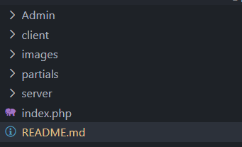

# 🛍️ TechShop – E-Commerce Website

Welcome to **TechShop**, a modern and minimal e-commerce platform built for all your gadget needs! ⚙️  
Built using **PHP**, **HTML**, **Tailwind CSS**, and **MySQL**, this platform allows users to shop seamlessly with a complete cart and wishlist experience.

🔗 **Visit the Website:** [TechShop Live](http://techshop.infinityfreeapp.com/?i=1)

---

## 🚀 Features

✨ **User Authentication**  
- 🔐 Signup, Login, Logout system with session management  
- 🔒 Secure password handling and validation  

🛒 **Shopping Experience**  
- ✅ Add to Cart functionality  
- ❤️ Wishlist page for favorite items  
- 📄 Individual Product Pages with details fetched dynamically

🧰 **User Dashboard**  
- View saved items in cart & wishlist  
- Continue shopping or proceed to checkout  

---

## 🛠️ Tech Stack

| Layer        | Technology                |
|--------------|---------------------------|
| 💻 Frontend  | HTML, Tailwind CSS        |
| ⚙️ Backend   | PHP                       |
| 🗄️ Database  | MySQL                     |
| 🌐 Hosting   | infinity                  |

---

## 🗃️ Database Overview (MySQL)

**Key Tables:**
- `users` – Stores user details (email, password, etc.)
- `products` – Product catalog with name, price, description, and image
- `cart` – Tracks items added to the cart by each user
- `wishlist` – Keeps a list of user's favorite products
- `orders`  – For storing order history if implemented

---

## 📂 Folder Structure


## 🧪 How to Run Locally

1. 📥 **Clone the Repo**
   ```bash
## https://github.com/rohitsingh2814/E-commerce.git
